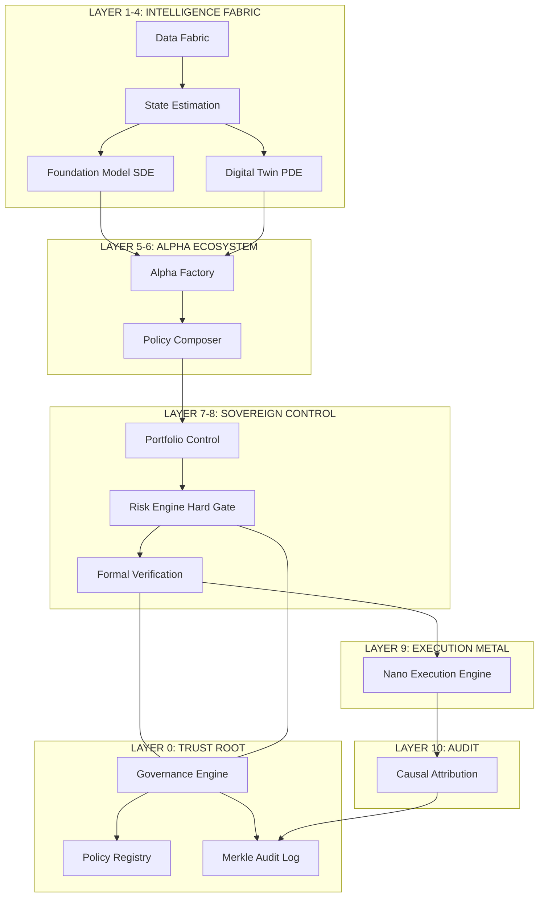

# FIOS: Architectural Dependency Graph

```mermaid
graph TD
    subgraph "LAYER 0: TRUST ROOT"
        G[Governance Engine] --> P[Policy Registry]
        G --> A[Merkle Audit Log]
    end

    subgraph "LAYER 1-4: INTELLIGENCE FABRIC"
        D[Data Fabric] --> E[State Estimation]
        E --> FM[Foundation Model SDE]
        E --> DT[Digital Twin PDE]
    end

    subgraph "LAYER 5-6: ALPHA ECOSYSTEM"
        FM --> AF[Alpha Factory]
        DT --> AF
        AF --> PC[Policy Composer]
    end

    subgraph "LAYER 7-8: SOVEREIGN CONTROL"
        PC --> PO[Portfolio Control]
        PO --> RG[Risk Engine Hard Gate]
        RG --> V[Formal Verification]
    end

    subgraph "LAYER 9: EXECUTION METAL"
        V --> EX[Nano Execution Engine]
    end

    subgraph "LAYER 10: AUDIT"
        EX --> CA[Causal Attribution]
        CA --> A
    end

    %% Hard Constraint Links
    V --- G
    RG --- G
```
